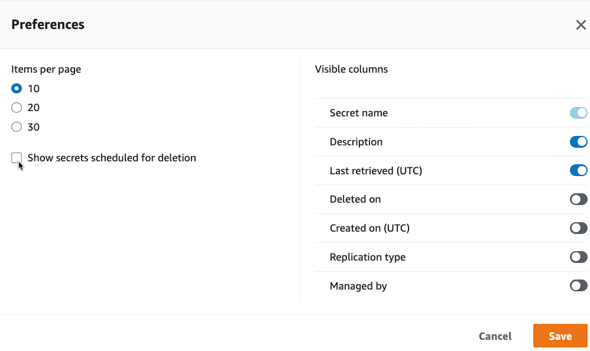
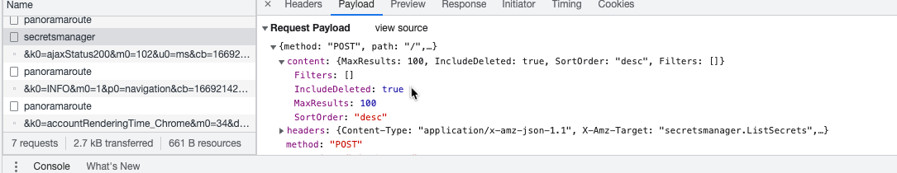

# List deleted secrets from AWS Secrets Manager

## Notice

AWS Secrets Manager now supports listing secrets scheduled for deletion with a new request parameter, `IncludePlannedDeletion`. This library has been updated to use that as `IncludeDeleted` is slated for deprecation.

-----------------------

When you delete a secret from *AWS Secrets Manager*, the standard 
`aws secretsmanager list-secrets` does *not* show these secrets.

Also there is no parameter to show the deleted /schedules for deletion secrets.

In the AWS console, you have the option to show these secrets also:


Debugging the AWS console, you see  that 
the console is cheating and using a parameter not defined in the API
Definition, see [API doc])https://docs.aws.amazon.com/secretsmanager/latest/apireference/API_ListSecrets.html#API_ListSecrets_RequestParameters).

So you have to change tp content of the request to:

```json
{
  "MaxResults": 100,
  "IncludeDeleted": true,
  "SortOrder": "desc",
  "Filters": []
}
```

## Implement with GO SDK V2

In go the input parameter for the secretsmanager.ListSecrets are
well defined, so any attempt to add a field will go wrong.

But because of the middleware, you can manipulate request at all stages.

See [AWS GO SDK V2 Middleware](https://aws.github.io/aws-sdk-go-v2/docs/middleware/) for documentation.

The middleware has several steps:


Stack Step |	Description
---|---
Initialize	|Prepares the input, and sets any default parameters as needed.
Serialize	|Serializes the input to a protocol format suitable for the target transport layer.
Build	|Attach additional metadata to the serialized input, such as HTTP Content-Length.
Finalize |	Final message preparation, including retries and authentication (SigV4 signing).
Deserialize |	Deserialize responses from the protocol format into a structured type or error.

The *Build* step seems fine for this.

So we append a function to the cfg with `ApiOptions`:

````go
cfg, err := config.LoadDefaultConfig(context.TODO())
if err != nil {
    panic("configuration error, " + err.Error())
}

cfg.APIOptions = append(cfg.APIOptions, func(stack *middleware.Stack) error {
    // Attach the custom middleware to the beginning of the Build step
    return stack.Build.Add(secretParameter, middleware.Before)
})
client = secretsmanager.NewFromConfig(cfg)
```

The function `secretParameter` now replaces the json content of the 
request to the api with the json data, which see console send.

## Run

```bash
go run main.go
```

Output:

```bash
Results
=======
Secret: deleteme / deleted on 2022-11-23 12:23:58.374 +0000 UTC
```

## Show details

Now you may describe the secret:

```bash
aws secretsmanager describe-secret --secret-id deleteme
```

## Really delete

And you cann delete it for good - use at you own risk!

```bash
aws secretsmanager delete-secret --secret-id deleteme --force-delete-without-recovery
```

